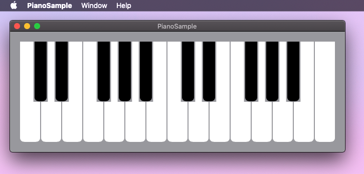

# PianoSample

<!-- # Short Description -->

Playable Piano using SwiftUI & Combine

<!-- # Badges -->

# Tags

`SwiftUI` `Combine` `AVAudioUnitSampler`

# Demo

You can play this piano by dragging keys.

# Installation

1. Clone this repository.  
`$ git clone https://github.com/Kyome22/PianoSample.git`
2. Open PianoSample.xcodeproj by Xcode.app.  
3. Build PianoSample target.

# Contributors

- [Kyome22](https://github.com/Kyome22)

<!-- CREATED_BY_LEADYOU_README_GENERATOR -->